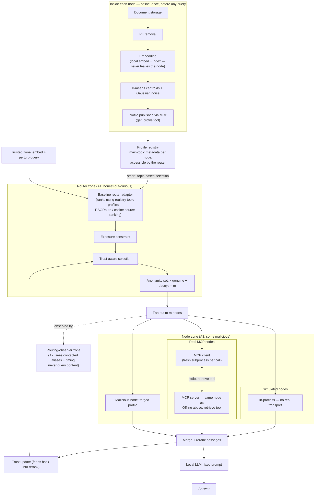

# Architecture

Three trust zones. The router sits in the middle with an adversary on each side.

## Zones

**Trusted zone (user side).** Query embedding and perturbation happen here.
Generation also happens here, on a local open-weight model with a fixed prompt.
This avoids disclosure to an external model provider. Output leakage is not
evaluated in this project, but local generation does not make it impossible.

**Router zone (honest but curious).** Holds the profile registry and makes the
selection. This is the A1 adversary. It never holds documents.

**Routing-observer zone.** Observes contacted source aliases and timing over many
queries but not the query content. This is the A2 adversary. It may represent
network telemetry, shared audit infrastructure, or an operational observer.

**Node zone (some malicious).** Each node holds its own documents and local
index. At least one forges its published profile — the A3 adversary.

## Online path

```
query
  -> embed (user side)
  -> perturb embedding (user side)
  -> BASELINE ROUTER ADAPTER
       RAGRoute / cosine source ranking
  -> PROPOSED PRIVACY LAYER
       exposure constraint
       trust-aware selection
       anonymity set    k + decoys = m <= fan-out budget
  -> fan out to m nodes
  -> each node retrieves locally, returns top-n passages
  -> merge and rerank
  -> trust update (feeds back into rerank)
  -> local LLM, fixed prompt
  -> answer
```

The perturbed embedding travels the whole path. Nodes never see the clean query.
Decoys nevertheless increase the number of nodes receiving a query-derived
representation, so route privacy and query exposure must be measured separately.



**The router only ever sees topic metadata, never documents.** The offline
stage (top) runs once per node, independent of any query — it is what makes
selection "smart": the router picks candidates by comparing a query against
each node's published topic profile (the registry), *before* the privacy
layer (exposure constraint, trust-aware selection, anonymity set) ever
touches the ranking. This is already the real implementation, not a proposed
change: `nodes/profile.py` builds the offline profile, `router/registry.py`
holds it, and `baselines/*.py` + `router/pipeline.py` are the two stages
after it. The offline MCP `get_profile` call and the online MCP `retrieve`
call in the diagram above hit the *same* node process
(`nodes/mcp_server.py`) — profile publication and query-time retrieval are
two tools on one server, not two different nodes.

## Baseline-first implementation

The project does not rebuild standard source routing before testing existing
implementations. Official RAGRoute is the primary relevance/efficiency platform.
Mu and Li's public routing-hijacking repository supplies the A3 attack, HERouter
comparison and TASR defence. Both are accessed through a small adapter that
returns ranked source IDs, scores and timings. Broadcast, random and cosine
controls are implemented locally because they are small and transparent.

RAGRouter is an adjacent peer-reviewed method, not the primary baseline: it routes
among retrieval-augmented language models rather than distributed knowledge
sources.

## Offline path (once per node)

```
document storage
  -> PII removal
  -> local embed and index      [never leaves the node]
  -> k-means, 16 to 64 centroids
  -> add Gaussian noise
  -> publish via MCP            [only this leaves]
```

PII removal runs **before** embedding. If it runs after, the embeddings encode
the PII and the published centroids inherit it.

## Attack surfaces

| ID | Attack | Adversary | Where |
|---|---|---|---|
| A1 | Query inversion | Honest-but-curious router | Router holds the perturbed embedding |
| A2 | Source inference | Observer of selection patterns | The fan-out, across many queries |
| A3 | Routing hijack | Malicious node | Profile publication, surfaces at rerank |

A2 is the project's primary new measurement. It makes "routing decisions as
metadata" concrete rather than rhetorical; novelty is stated as a finding of the
reviewed literature until the final literature search is completed.

## MCP as node interface

Each live demonstration node is an MCP server exposing a `retrieve` tool. The
coordinator is the client.
This gives real transport, real serialisation, and honest byte counts instead of
hand-waved communication costs.

**Split the scale claim.** Real MCP servers at 8 to 16 nodes prove the
architecture works over an actual protocol; measure real bytes and latency there.
In-process simulation with mocked transport covers 100, 300, and 1000 nodes for
scaling analysis. State this split explicitly in the thesis. Claiming 1000 live
MCP nodes when 16 are running is the kind of thing that unravels in a viva.

## Instrumentation

A logger taps every arrow: nodes contacted, bytes, per-stage latency, which
passages survived into the final answer, and the full routing decision.

Build this in month 2. Without it, month 6 means rerunning everything.
