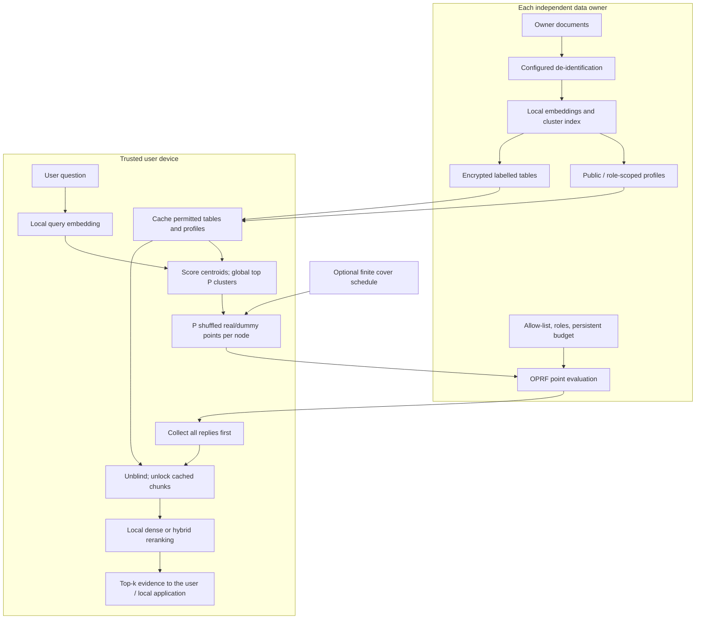

# Current Architecture

**Recommended privacy deployment:** standalone client, blind dispatch, local embeddings and local generation. The Studio is a demonstration, not the same trust boundary.

**Offline:** owner prepares de-identified data if enabled; publishes profiles and role-permitted encrypted tables. The client caches them. Signatures require suitable configuration and identity provisioning; defaults are not universally strict.

**Large hospitals ([[PIR tier]]):** instead of the table, the device downloads a fixed hint + tag map and fetches the real clusters' sealed chunks with exactly F PIR queries per hospital (one extra round trip; the hospital scans its table per query).

**Scope:** answer generation is outside the thesis; the pipeline ends at ranked evidence.

**Online:** the device picks global top-P clusters. Every node receives P points, including dummies. Replies are collected before local unlocking. The device ranks opened passages and supplies selected evidence to a local generator.

**Budget meaning:** P is real cluster selection budget globally and padded evaluation count per node. N nodes mean N x P online evaluations, not P source contacts. One cluster may disclose many passages.

**Limits:** public centroids still disclose structure; metadata sizes and identity remain visible; stale caches, node failures and timing need operational treatment. No verified malicious-server scoring or prompt-injection defence. See [[Threat model]], [[Cover traffic]], [[Profile signing]] and [[Source reconciliation]].

## Implementation / Experiment Sources

- [backend/client/device.py](../backend/client/device.py)
- [backend/privacy/blind_unlock.py](../backend/privacy/blind_unlock.py)
- [backend/nodes/simulator.py](../backend/nodes/simulator.py)
- [backend/client/cover.py](../backend/client/cover.py)

These sources support the scoped note; older source prose may require the corrections in [[Source reconciliation]].
